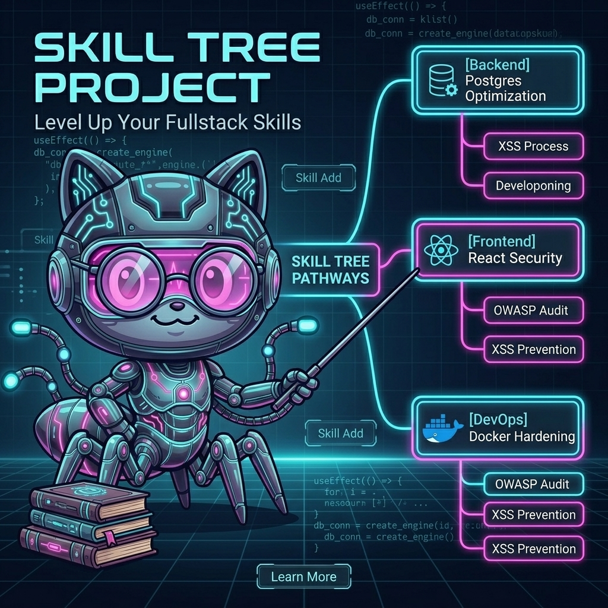

# 🌲 .skilltree

[](https://www.npmjs.com/package/@leosdc/skilltree)
[](https://www.npmjs.com/package/@leosdc/skilltree)
[](https://github.com/Leosdc/skilltree/stargazers)
[](https://github.com/Leosdc/skilltree/issues)
[](LICENSE)



> O repositório universal de árvore de habilidades para Agentes de IA.

O `.skilltree` é um framework modular plug-and-play projetado para residir na raiz do seu workspace. Ele funciona como uma ramificação local de capacidades que injeta regras de prompt especializadas, automações e diretrizes de desenvolvimento nos seus agentes de IA preferidos (como VSCode Copilot, Antigravity, Claude Code, Windsurf e fluxos de agentes personalizados).

O projeto é baseado no conceito de **orquestração comunitária**: um catálogo expansível de habilidades atômicas compiladas dinamicamente para instruir seus assistentes de IA de forma segura.

---

## 🚀 Conceito e Arquitetura

Em vez de configurar regras separadas para cada ferramenta de IA, você clona o `.skilltree` diretamente na pasta do seu projeto ativo como uma subpasta oculta:

```bash
git clone https://github.com/Leosdc/skilltree.git .skilltree
```

Uma vez inserido, o compilador CLI analisa as tecnologias do projeto hospedeiro, injeta as regras ativas nos arquivos de workspace locais (`.cursorrules`, `.clauderules`, `.windsurfrules`, `.copilot-instructions.md`, etc.) e **sincroniza de forma automática e transparente com as configurações globais de IA no seu sistema** (incluindo o Antigravity IDE, VS Code / Copilot, Cursor e Windsurf em nível de usuário), garantindo a injeção instantânea de diretrizes de governança em agentes de chat e assistentes autônomos.

---

## 💡 Por que o `.skilltree`? (Vs. Abordagem Clássica)

Tradicionalmente, os desenvolvedores gerenciam as diretrizes de prompt para agentes de IA de forma fragmentada, manual e monolítica. O `.skilltree` introduz um paradigma modular, compilado e pronto para o trabalho em equipe:

| Aspecto | Abordagem Clássica (Manual) | O Paradigma `.skilltree` |
| :--- | :--- | :--- |
| **Fragmentação de Agentes** | O desenvolvedor precisa criar e atualizar manualmente arquivos separados (`.cursorrules`, `.clauderules`, `.windsurfrules`, `.github/copilot-instructions.md`). | **Compilação Unificada:** O compilador CLI escreve as diretrizes consolidadas em todos os principais arquivos de regras de forma simultânea. |
| **Regras Monolíticas** | Instruções de IA são coladas em um único arquivo gigante, sobrecarregando a janela de contexto do LLM com regras não relacionadas à tarefa atual. | **Nós Atômicos e Hot-Swappable:** Habilidades são diretórios isolados. Ligue e desligue capacidades dinamicamente dependendo da tarefa do dia. |
| **Descoberta Passiva** | O programador precisa lembrar quais regras aplicar. Membros novos do time desconhecem as diretrizes e padrões de segurança do projeto. | **Scanner Autônomo:** O CLI analisa as dependências (`package.json`) e os arquivos do projeto para recomendar proativamente as regras corretas. |
| **Sincronização do Time** | Regras ficam isoladas na máquina de cada programador de forma manual, gerando prompts obsoletos e falta de padronização. | **Versionado no Git e Comunitário:** O repositório reside no workspace. Atualizações de prompts são compartilhadas com o time via Pull Requests. |
| **Segurança e Compliance** | Programadores colam instruções arbitrárias da internet, correndo risco de burlar políticas de segurança locais do agente. | **Catálogo Auditável:** Políticas centrais de segurança (ex: conformidade OWASP, imagens Docker seguras) são aplicadas uniformemente em toda a equipe. |

---

## 🛠️ Compatibilidade Unificada com Agentes

O `.skilltree` é agnóstico. Ele padroniza os manifestos e gera os vetores de injeção locais e globais corretos para cada ambiente:

| Agente de IA | Canal de Injeção | Tipo de Integração |
| :--- | :--- | :--- |
| **Antigravity IDE (Gemini)** | `user_rules.txt` global e `.cursorrules` local | Sincronizado dinamicamente na inicialização de agentes autônomos para leitura e aplicação obrigatória das regras locais. |
| **Cursor** | `.cursor/rules/*.mdc` (Scoped) e `.cursorrules` | Suporta compilação inteligente para arquivos `.mdc` individuais com suporte a triggers glob (frontmatter). |
| **VS Code (Copilot / Chat)** | `.copilot-instructions.md` local e `settings.json` global | Injetado nas instruções personalizadas do chat global e do Copilot. |
| **Claude Code / Cowork** | `.clauderules` | Injetado dinamicamente no terminal do agente de CLI da Anthropic. |
| **Windsurf** | `.windsurfrules` local e `settings.json` global | Lido automaticamente pelo assistente integrado da IDE Windsurf de forma local e global. |
| **OpenClawn / Custom** | `.clawnrules` e `active-tree.json` | Carregado por agentes de terminal customizados e orquestradores locais. |

---

## 🌐 Internacionalização Nativa (i18n)

O `.skilltree` suporta múltiplos idiomas nativamente, permitindo que desenvolvedores do mundo todo consumam prompts e regras no seu idioma preferido:

*   **Seletor Interativo:** Na primeira execução, a CLI solicitará que você selecione seu idioma preferido (Inglês ou Português), que é salvo em `.skilltree/config.json`. Você pode alterar isso a qualquer momento no menu da CLI.
*   **Compilação Localizada:** O compilador lê automaticamente arquivos de prompt localizados (`prompt.<lang_code>.md` como `prompt.pt.md`) e traduções do manifesto (`locales` no `manifest.json`), compilando as regras nas configurações locais do idioma ativo.
*   **Contexto Isolado:** Mantém as diretivas de prompt separadas por idioma, evitando misturar instruções em português e inglês que poluem e confundem o contexto do LLM.

---

## 📁 Estrutura do Repositório

```text
.skilltree/
├── bin/
│   └── skill-add.cjs            # Utilitário CLI universal (CommonJS)
├── tree/                        # Catálogo de habilidades locais por categoria
│   ├── backend/
│   │   └── postgres-expert/
│   ├── DevOps/
│   │   └── docker-hardening/
│   ├── security/
│   │   └── owasp-audit/
│   └── frontend/
│       └── react-security/
└── active-tree.json             # Estado persistido das habilidades ativas
```

---

## 🏁 Início Rápido

### Opção 1: Via NPM (Recomendado)

1. Instale o pacote [@leosdc/skilltree](https://www.npmjs.com/package/@leosdc/skilltree) no seu projeto:
   ```bash
   npm i @leosdc/skilltree
   ```
2. Abra o painel interativo:
   ```bash
   npx skilltree
   ```

### Opção 2: Via Clone do Git (Local)

1. **Clone** o repositório como uma pasta oculta `.skilltree` na raiz do seu projeto ativo:
   ```bash
   git clone https://github.com/Leosdc/skilltree.git .skilltree
   ```
2. **Execute a CLI** usando Node.js para abrir o painel:
   ```bash
   node .skilltree/bin/skill-add.cjs
   ```

---

## 🎮 Controles e Comandos

Use as **setas do teclado (↑/↓/←/→)** para navegar pela grade de habilidades e o menu de ações, pressione **[Espaço] ou [Enter]** para ativar/desativar habilidades locais, e selecione as opções do menu inferior para executar varreduras, criar habilidades ou gerenciar o idioma.

Se preferir a linha de comando direta sem interface visual:
*   **Ativar habilidade**: `npx skilltree add <id-habilidade>` (ou `node .skilltree/bin/skill-add.cjs add <id-habilidade>`)
*   **Desativar habilidade**: `npx skilltree remove <id-habilidade>`
*   **Executar Varredura**: `npx skilltree scan`

---

## 🤝 Contribuindo para o Projeto

Queremos expandir a Skill Tree e torná-la o maior catálogo de orquestração de IA do mundo! Se você deseja adicionar novas habilidades, otimizar regras de segurança ou melhorar o core da CLI, leia o nosso **[Guia de Contribuição (CONTRIBUTING.pt-BR.md)](CONTRIBUTING.pt-BR.md)**. 

Lá explicamos nosso fluxo de branches (`feature/`, `bugfix/`), commits semânticos e padrões de escrita de prompts atômicos.

---

Para documentação de integração com cada IDE, consulte [TUTORIAL.pt-BR.md](TUTORIAL.pt-BR.md).
Para histórico de atualizações, consulte [CHANGELOG.md](CHANGELOG.md).
